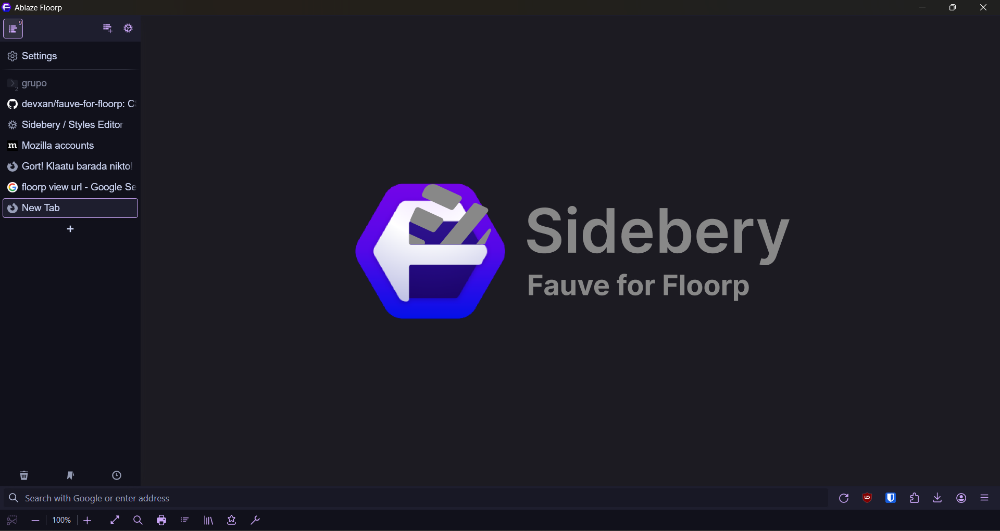
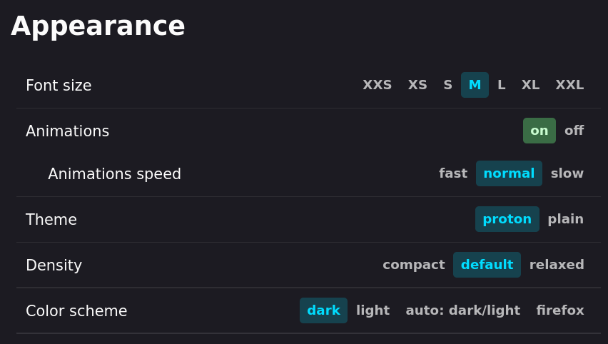

# Fauve for Floorp

A simple [Sidebery](https://github.com/mbnuqw/sidebery) CSS file for use with (a specific configuration using) Floorp or a modification of Firefox.

Xan uses the [Catppuccin Mocha Mauve](https://addons.mozilla.org/en-US/firefox/addon/catppuccin-mocha-mauve-git/) theme with it.

My goal with these settings was to create a minimalistic yet functional setup
with Sidebery tuned to match Firefox Default Dark Theme and optimise the
workspace. If you find any odd behaviour feel free to send a pull request.

## Installation

1. Install [Sidebery](https://github.com/mbnuqw/sidebery/) from the [addon page](https://addons.mozilla.org/firefox/addon/sidebery/).
2. In Floorp, go to `about:preferences` and toggle the following options:
3. Open Sidebery settings and locate _Styles editor_ in the navigation. Paste the contents of [sidebery.css](sidebery.css) into the panel that says "Write custom CSS here..."
4. Find a theme, like Catppuccin, Dracula, Gruvbox, Noir, Nord, Tokyo Night, or .
5. Enjoy your new setup!

Set these settings under appearance in Sidebery (optional but recommended):

## Known issues

- Due to the width of the tabs, if marks to indicate indentation is enabled, multiple lines may show. This can be fixed by increasing the width of tabs.

## Credits

- to [@mgastonportillo](https://github.com/mgastonportillo) for their [Gale for FF](https://github.com/mgastonportillo/gale-for-ff)
- to [u/captainkaba](https://www.reddit.com/user/captainkaba/) for his [Denkfabrik](https://www.reddit.com/r/FirefoxCSS/comments/rqo5z6/some_people_asked_for_the_css_so_here_is_my_setup/) theme (which was used as a base)
- to Reddit user [u/It_Was_The_Other_Guy](https://www.reddit.com/user/It_Was_The_Other_Guy/) for his [tip](https://www.reddit.com/r/FirefoxCSS/comments/vzcqzn/comment/ig8a8ba/)